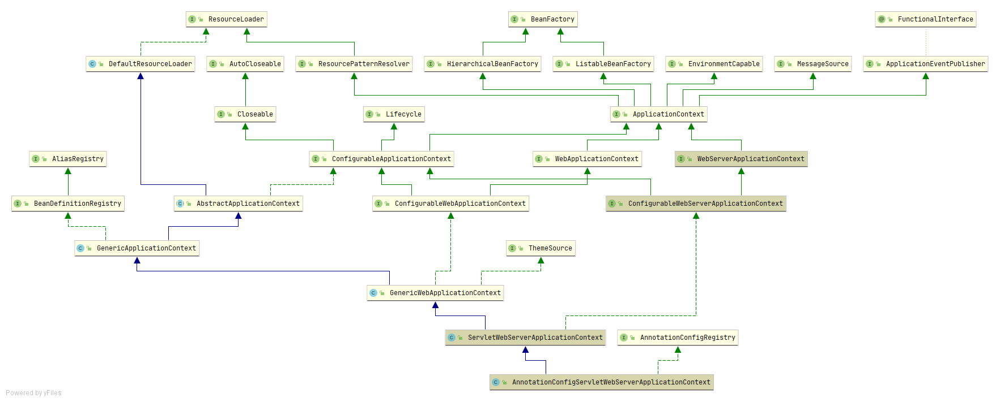

+ ServletWebServerApplicationContext  
    + AnnotationConfigServletWebServerApplicationContext  
        + GenericApplicationContext[../4-]
            + ServletWebServerApplicationContext.selfInitialize
              > -> [容器的初始化（四）之 Spring Boot 集成](4_容器的初始化（四）之%20Spring%20Boot%20集成.pdf)  
              真正的去启动tomcat -> beans.onStartup(servletContext);  
              这里典型的回调方式， 当匿名ServletContextInitializer类被TomcatStarter的#onStartUp()方法调用， 设置上触发了#selfInitialize(servletContext servletContext)方法调用  
              TomcatStarter -> selfInitialize -> getServletContextInitializerBeans()
              + new TomcatWebServer(tomcat, getPort() >= 0)  
                + initialize
